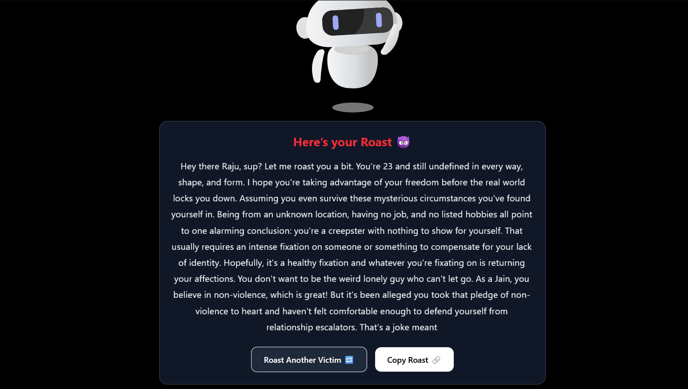

# 🔥 AI Roast Generator

Bring the burn! This AI-powered roast generator delivers hilariously brutal roasts based on 8 savage questions using Cohere's language model.

 ---

## 🚀 Features

- 😈 Engaging 3D Avatar (Lottie Animation)
- 💀 Brutally savage AI-generated roasts
- 🎯 8 fun & roastable questions (Name, Age, etc.)
- 🔊 Sound effects & smooth animations (Framer Motion)
- 📋 Copy roast to clipboard
- 🔁 Try Again functionality
- ⚡ Powered by [Cohere API](https://cohere.com)

---

## 🛠️ Tech Stack

- **Frontend**: React.js + TailwindCSS + Vite
- **Animations**: Lottie, Framer Motion
- **AI Backend**: Cohere Generate API (`command` model)

---

## 🧠 How It Works

1. User answers 11 roastable questions.
2. Prompt sent to Cohere's language model.
3. Savage roast generated and displayed with animation.
4. User can copy or try again.

---

## 🧪 Local Development

### 1. Clone the Repo

```bash
git clone [https://github.com/your-username/ai-roast-generator.git](https://github.com/your-username/ai-roast-generator.git)
cd ai-roast-generator
```

### 2. Install Dependencies
```bash
npm install
```

### 3. Set Up Environment Variable
Create a ```.env``` file in the root directory:
```bash
VITE_API_KEY=your_cohere_api_key_here
```

### 4. Run the App
```bash
npm run dev
```

---

## 🌐 Deployment

This project is easily deployable on [Vercel](https://vercel.com):

1. Push to GitHub
2. Import repo to Vercel
3. Add the VITE_API_KEY in Project → Settings → Environment Variables
4. Deploy!

---

## 🔒 Disclaimer

This app contains dark humor and edgy content. Intended for entertainment only. Use responsibly and don’t take the roast personally 😅.

---

## 🤝 Credits

- 💡 Idea: Ujjawal
- 🤖 AI Model: [Cohere](https://cohere.com/)
- 🎨 Lottie Avatar: [LottieFiles](https://lottiefiles.com/)

---
---

## 📜 License


This project is free to use for personal and educational purposes.  
Feel free to fork, remix, or roast your friends — just don’t use it for commercial purposes without permission.

© 2025 ❤️Ujjawal


